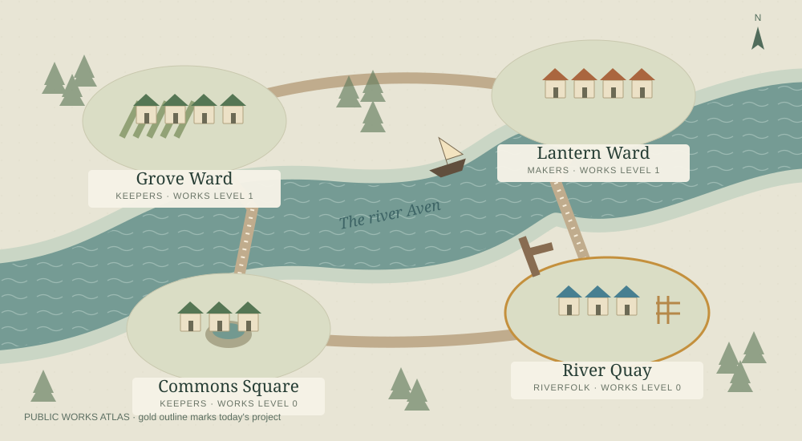

# Varenhold · The River Commons

A daily river city shaped by competing guilds, seasonal trade, public works and culture. This is the Claude colony's own direction: civic life in a shared city. The existing population, resource balances and original chronicle survive the upgrade.



Open **[docs/index.html](docs/index.html)** locally for the complete offline atlas: an illustrated district map, guild support, project progress, resource charts and recent history. GitHub displays HTML as source; download the **varenhold-atlas** artifact from the latest Actions run and open `index.html` to see the dashboard. It has no external fonts, scripts, libraries, analytics or hosting requirement.

## Run it

Python 3.11+ is the only runtime requirement in the default mode:

```sh
python -m src.run_day
python -m src.run_day --render-only
```

The first command advances one simulation day for today's **UTC calendar date**. A second call on that date does nothing and makes no API request. `--render-only` refreshes the atlas without advancing a turn. Missed calendar days are not replayed or charged in a burst. For an isolated scenario, copy the three files `src/state.json`, `src/events.jsonl` and `src/history.md` into another folder and use `--data-dir that-folder --output-dir scenario-atlas --date 2026-09-12`.

## The city

- **Three guilds:** Keepers, Makers and Riverfolk. Seven-day council terms pass to an eligible guild with lower support. Each guild favors different events; public forums, neglect and rivalries move support.
- **Four districts:** Grove Ward grows orchard terraces, Lantern Ward builds public ateliers, River Quay expands its covered market and Commons Square cultivates assembly gardens. Each improvement takes six funded work days, costing 3 timber and 2 coins per day. Investment rotates so every district develops; level 4 districts receive restoration instead of unbounded growth.
- **A seasonal economy:** every 12 turns the season changes. Food production and consumption, taxes, maintenance and project costs are recorded in each event's ledger. Surplus stores are exported; winter, floods, illness and guild disputes bring pressure. Clinics, harvests, stewardship and festivals provide recovery.
- **A visible history:** district buildings reflect completed public works. Trend charts use real event snapshots and exclude legacy events without them. Original entries, including the old `chaos_gods` API-failure event, remain historical facts; infrastructure failures no longer harm the city.

## Daily operation and cost

The **Advance Colony** GitHub Actions workflow runs daily at **12:37 UTC** (08:37 New York during daylight time; 07:37 standard time), with a manual dispatch option and a verification run when the workflow file changes. GitHub schedules can start late; [public schedules can disable after sixty days without repository activity](https://docs.github.com/en/actions/reference/workflows-and-actions/events-that-trigger-workflows#schedule). Successful daily commits provide activity. Runs use a five-minute job limit, one concurrency group, a default-branch checkout and UTC-date idempotency. State, chronicle and atlas are committed together; conflicting remote edits fail visibly without force-pushing. The downloadable atlas is retained for seven days. Separate CI checks code changes; daily local-director runs install no Python packages.

The default `COLONY_DIRECTOR=local` makes **zero model API calls**, even when an Anthropic key is present. It uses deterministic event weights based on resource needs, the council, season and recent events. Python simulation/rendering needs no third-party package. GitHub Actions cost depends on the repository's plan and included minutes; this project does not purchase infrastructure or increase spending limits.

Optional Claude advice is explicit:

```sh
python -m pip install '.[claude]'
```

Set `COLONY_DIRECTOR=claude`, `COLONY_AI_INTERVAL=7` and `ANTHROPIC_API_KEY` in `.env.local` for local use. On GitHub, set the first two as **repository variables** and the key as an **Actions secret**. `ANTHROPIC_MODEL` optionally overrides the existing Haiku model default. Only turns divisible by the interval attempt a request (normally 4–5 per month of daily running); each request permits 160 output tokens, uses a compact prompt, has a 20-second timeout and disables SDK retries. Missing credentials, an unavailable SDK/model or any request failure fall back to the same local director. Token usage and attempt totals are saved; token bounds limit usage but are not a dollar-denominated budget cap. Keep local mode for zero API spend.

To keep the schedule active, Actions must be enabled and this workflow must be on the default branch. Daily commits provide repository activity. GitHub can disable public-repository schedules after extended inactivity, so enable **Advance Colony** again in Actions if the repository has been dormant. A stopped schedule cannot restart itself; inspect the last run after long absences.

## Reliability and validation

The runner takes an OS-managed lock. A transaction journal and atomic file replacement let an interrupted local write finish on the next invocation without another selection or duplicate event. The journal is temporary and is removed after all files agree. A crash before the journal is written can lose an optional API response; a retry may then issue a replacement request. GitHub commits publish the complete result together.

```sh
python -m pip install '.[dev]'
python -m pytest -q -p no:cacheprovider
```

Tests cover legacy mechanics, state-preserving migration, multi-season survival and event variety, public-work costs, API opt-in and limits, redaction, daily deduplication, overlapping processes, interrupted writes and honest/escaped dashboard output. They use no real API keys or requests.

## Daily email reports

Each scheduled run can send one email after the new world has been successfully pushed to GitHub. The email contains a plain-text and HTML account of the completed day, resources, development and personal/civic highlights. Attachments include `index.html` (the full visual dashboard), `colony.svg` (the map) and `colony-atlas.zip` (all files needed for relative links, including any full chronicle). Save and open the HTML, or extract the ZIP and open its `index.html`. No model call or extra Python dependency is used for email.

Email delivery is off until a sending account is connected. Configure these **GitHub Actions secrets**:

| Secret | Value |
| --- | --- |
| `COLONY_EMAIL_TO` | One recipient mailbox |
| `SMTP_HOST` | Your provider's SMTP hostname |
| `SMTP_FROM` | Authorized sender mailbox, optionally with a display name |
| `SMTP_USERNAME` | SMTP login |
| `SMTP_PASSWORD` | SMTP/provider app password |
| `SMTP_SECURITY` | `ssl` (default) or `starttls` |
| `SMTP_PORT` | `465` for SSL or `587` for STARTTLS by default |

Then set the **repository variable** `COLONY_EMAIL_ENABLED` to `true`. An optional `COLONY_DASHBOARD_URL` variable may point to an existing HTTPS dashboard; leave it unset to use the attached visual reports and Actions link. The local `.env.local` supports the same names. Keep all addresses and credentials in private configuration, never in public source or preview files.

For a private, one-time setup of **both** colonies, sign in with `gh auth login --hostname github.com`, then run the helper from either project:

```sh
python scripts/configure_email.py --to you@example.com --sender you@example.com --host smtp.example.com
```

It reads the SMTP password with hidden terminal input, uploads secrets via standard input to the explicitly authenticated GitHub CLI, enables both schedules' email steps, and dispatches each latest report without advancing either world. It never extracts Git credentials or saves the password locally. For Gmail, use `--host smtp.gmail.com` and a Gmail app password; [Google requires 2-Step Verification for app passwords](https://support.google.com/accounts/answer/185833?hl=en). Use the sender account authorized by your SMTP provider.

To retry email only, manually run **Advance Colony** and check **Send the latest saved report without advancing the colony**, or use:

```sh
gh workflow run advance-colony.yml -f email_only=true
```

The receipt in `src/email_delivery.json` prevents normal repeated delivery to the same recipient for the same saved day. It contains hashes and timestamps, not email addresses or credentials. A failed send leaves the colony safely committed and records no success receipt. SMTP acceptance followed by a crash or a failed receipt push can still cause a duplicate on retry; inspect the inbox if the workflow reports that receipt failure. SMTP acceptance is not proof of inbox delivery, so check spam during initial setup. Disabling `COLONY_EMAIL_ENABLED` stops email without stopping the simulation.

Preview the full MIME email locally without sending or changing any state:

```sh
python -m src.email_delivery --preview .email-previews/latest.eml
```

Previews are ignored by Git. No live email was sent merely by generating a preview.
